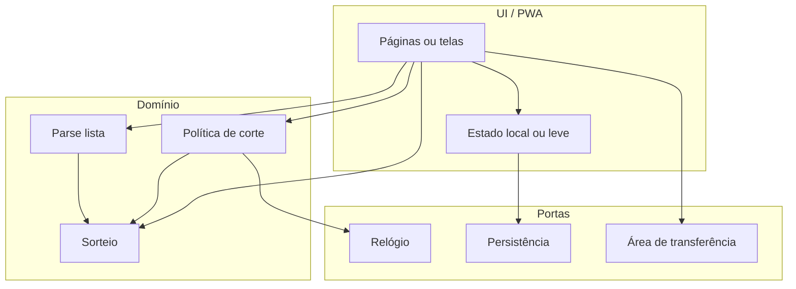

# Arquitetura (proposta)

> Esta seção descreve a arquitetura **alvo** para evoluir o projeto mantendo regras no código e documentação navegável.

## Princípios

1. **Domínio puro:** parse, sorteio, política de corte e validações vivem em módulos testáveis **sem** depender de React/DOM/localStorage.
2. **Adaptadores finos:** UI, persistência e relógio injetados ou isolados para testes (ex.: “agora” mockável para o corte).
3. **Persistência burra:** armazenar estado serializado; não codificar regras em SQL ou esquema além de tipos.

## Camadas sugeridas

## Stack recomendada (encaixe com as regras do projeto)

| Camada | Sugestão | Motivo |
|--------|----------|--------|
| App web + PWA | **Vite** + **TypeScript** + **React** (ou manter HTML e extrair módulos TS) | Build rápido, tipagem para regras, testes com Vitest |
| Domínio | Pacote ou pasta `src/domain/` | Testes unitários pesados no parse e no sorteio |
| Deploy | **Páginas estáticas** (GitHub Pages, Cloudflare Pages, Netlify) | Custo zero, HTTPS para PWA |
| Backend opcional | **Só se** o corte precisar ser **único na nuvem** (vários dispositivos) | Workers / serverless com um endpoint “hora do jogo” e lock; caso contrário, corte **somente no aparelho do organizador** |

## Fluxo de corte (dois modos possíveis)

| Modo | Quando usar | Observação |
|------|-------------|------------|
| **Local** | Só o organizador usa o app | Horário de jogo + regra T−10min no `domain/lock`; relógio = `Date` do dispositivo |
| **Coordenado** | Vários acessos ou desconfiança do relógio | Servidor guarda `matchStartAt` e `lockedAt`; cliente só exibe |

Detalhes em [F-003](../features/F-003-corte-lista.md).

## Onde não colocar lógica

- Triggers SQL, views com regra de sorteio, ou “stored procedures” de negócio.
- Formatação WhatsApp pode ficar em `domain/export` ou `adapters/whatsappFormat` — é apresentação, mas convém testar snapshots de string.
