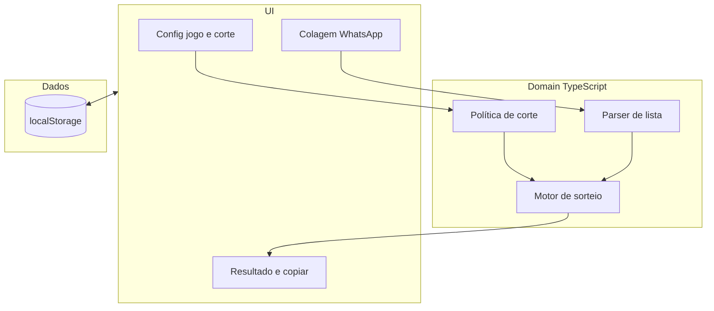

# Arquitetura — visão geral

## Stack recomendada (alinhada ao projeto)

| Camada | Escolha sugerida | Motivo |
|--------|-------------------|--------|
| Linguagem | **TypeScript** | Regras de domínio testáveis, tipos compartilhados, documentação via TSDoc nos pontos de entrada. |
| UI | **Vite + React** (ou manter HTML e extrair JS para módulos TS) | Mobile-first, ecossistema maduro, fácil PWA com `vite-plugin-pwa`. |
| Domínio | **Pacote ou pasta `src/domain/`** puro | Sorteio, parsing, política de corte **sem** React/DOM. |
| Testes | **Vitest** | Mesma toolchain do Vite; testes de unidade obrigatórios para `domain/`. |
| Persistência local | **localStorage** + versão de schema | Rápido, offline; serializa apenas dados, não regras. |
| Backend opcional | **Nenhum no MVP**; se precisar sync entre dispositivos depois: API mínima (Node/Fastify ou serverless) que persiste **snapshots** já calculados | Regras continuam no cliente ou em biblioteca compartilhada, não no SQL. |

## Diagrama lógico (MVP)

## Fronteiras

- **`domain/`:** funções puras (ou com RNG injetável para testes): `parseLista`, `sortearTimes`, `aplicarCorte`, tipos `Jogador`, `SnapshotSorteio`.
- **`app/` ou `components/`:** apenas orquestração, timers de UI, formatação de texto para clipboard.
- **`storage/`:** `load`/`save` de JSON; migração de chaves quando mudar o schema.

## Estado atual

O repositório já está estruturado em `src/domain/`, `src/ui/`, `src/storage/`, `src/utils/`. O sorteio é em **2 times** (Colete Azul × Colete Vermelho), com goleiros separados do sorteio de linha (ver [F-002](../features/F-002-sorteio-times.md)).

A suíte `tests/qa.ts` cobre parser, sorteio e exportador.

Detalhes de regras: [business-rules/README.md](../business-rules/README.md).
